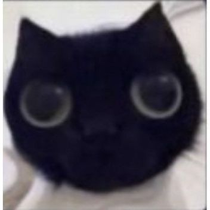

# Tower Defense Pixel Art (Sin nombre aún)

Un proyecto colaborativo para crear un juego de **Tower Defense** con estética **Pixel Art** en **Godot Engine**.

Aun no sabemos que pedo, pero en eso andamos

## El Equipo
* **Jose Julian - Rediun**
* **Devin Alonso - Pendejosaurio**

## Control de Calidad
Este proyecto está bajo la estricta supervisión de:

*Gato, el jefe de operaciones.*

---

## Info Técnica
* **Motor:** Godot Engine 4.6.1
* **Lenguaje:** C#
* **Estado:** Definición de mecánicas y prototipado inicial.